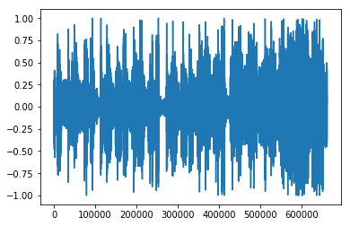
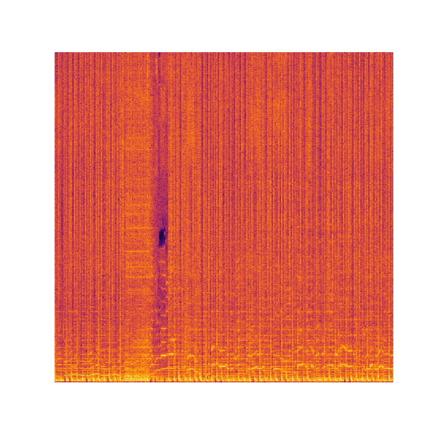
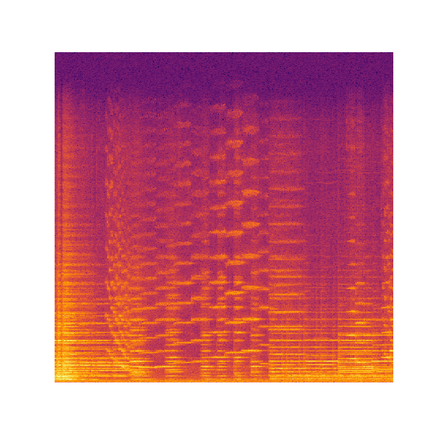

# Pre Trained VGG16 for Genre classification
Trained CNN model for Genre classification on GTZAN dataset 
## Overview
For train CNN model of deep learning:

1. Read the audios as melspectrograms, spliting them into 3s windows with 50% overlaping resulting in a dataset with the size 19000x129x128x1 (samples x time x frequency x channels)**.
2. Shuffle the input and split into train and test (70%/30%)
3. Train the CNN and validate using the validation dataset

** In the case of the VGG, the channel need to have 3 channels
## Dataset
The genres I am classifying are:
1. blues 
2. classical 
3. country 
4. disco  
5. hiphop 
6. jazz 
7. metal 
8. pop 
9. reggae 
10.rock 
## Data preprocessing
Before training the classification model, we have to tranform raw data from audio samples into more meaningful representations. [Librosa](https://github.com/librosa/librosa) has several methods for extracting various useful audio features: STFT (Short-Time Fourier Transform), Mel-spectrogram, MFCC (Mel-frequency cepstral coefficients), CQT (Constant-Q Transform), Harmonic-Percussive spectrogram, Chromagram .
Having a big data set isn't enough, in oppose to image tasks I cannot work straight on the raw sound sample, a quick calculation: 30 seconds × 22050 sample/sec- ond = 661500 length of vector, which would be heavy load for a convention machine learning method.
Following all the papers I read and researching a little on acoustic analysis, It is quit obvious that the industry is using Mel-spectrogram as the feature vector for the sound sample, I used librosa[9] implementation.
## Representing Music as Image
A very naive idea of mine was to simply plot the y values as shown below.  
  
By soon I realized that it won't just work as it doesn't give much information about tones and decided to go for melspectograms.  
A spectrogram is a visual representation of the spectrum of frequencies of sound or other signal as they vary with time. Spectograms allow looking at the whole song once and get the information about the tones present right away!  
  

## Transfer Learning
I used the pretrained model of VGG16 as feature extractors using Google Colab GPU.  
VGG16 has the accuracy of 75.6%  

